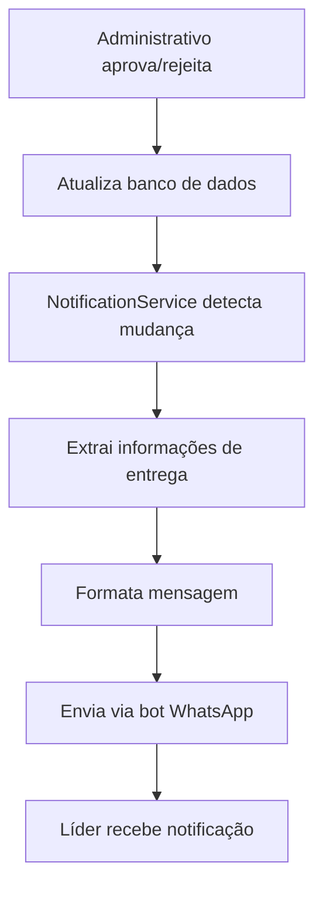

# Sistema de Notificações Automáticas

## Visão Geral

O sistema de notificações automáticas é responsável por enviar mensagens automáticas aos líderes (VIPs) quando suas solicitações de materiais são aprovadas ou rejeitadas pelo setor administrativo. O sistema funciona através de polling do banco de dados para detectar mudanças em tempo real.

## Funcionalidades Principais

### 🔔 Notificações Automáticas
- **Detecção automática** de mudanças no status das solicitações
- **Envio de mensagens** formatadas para os líderes
- **Extração inteligente** de informações de entrega
- **Polling em tempo real** (verificação a cada 30 segundos)

### 📱 Tipos de Notificação

#### Notificação de Aprovação
```
✅ SOLICITAÇÃO APROVADA!

Material: [Nome do Material]
Quantidade: [Quantidade]

📍 Local de Coleta: [Local]
🕐 Horário: [Horário]
👤 Procurar por: [Responsável]
📅 Data de Entrega: [Data]

[Resposta administrativa completa]

Em caso de dúvidas, entre em contato com o administrativo.
```

#### Notificação de Rejeição
```
❌ SOLICITAÇÃO NÃO APROVADA

Material: [Nome do Material]

Motivo: [Resposta administrativa]

Para mais informações ou para solicitar outros materiais, entre em contato com o administrativo.
```

## Arquitetura do Sistema

### Componentes Principais

#### 1. NotificationService (`src/lib/notification-service.js`)
- **Classe principal** que gerencia todo o sistema
- **Polling automático** do banco de dados
- **Formatação de mensagens** para diferentes tipos de notificação
- **Extração de informações** de entrega da resposta administrativa

#### 2. Integração com o Bot (`bot/index.js`)
- **Inicialização automática** do serviço quando o bot inicia
- **Integração com o cliente** WhatsApp
- **Gerenciamento de ciclo de vida** (start/stop)

#### 3. Página Administrativa (`src/app/admin/solicitacoes/page.tsx`)
- **Campos específicos** para informações de entrega
- **Formatação estruturada** da resposta administrativa
- **Integração com o banco** de dados

### Fluxo de Funcionamento



## Configuração e Uso

### Inicialização Automática
O serviço é inicializado automaticamente quando o bot é iniciado:

```javascript
// bot/index.js
client.on('ready', async () => {
    // ... código existente ...
    notificationService.init(client);
    notificationService.start();
});
```

### Configuração de Polling
- **Intervalo**: 30 segundos
- **Verificação**: Solicitações com `updated_at` > última verificação
- **Filtro**: Apenas solicitações com status diferente de 'pendente'

### Parada Graceful
O serviço é parado adequadamente quando o bot é encerrado:

```javascript
process.on('SIGINT', () => {
    notificationService.stop();
    // ... código existente ...
});
```

## Extração de Informações de Entrega

### Padrões Estruturados (Página Admin)
O sistema reconhece informações formatadas da página administrativa:

- `📍 Local de Coleta: [local]`
- `🕐 Horário: [horário]`
- `👤 Procurar por: [responsável]`

### Padrões Genéricos (Fallback)
Para respostas não estruturadas, o sistema usa padrões genéricos:

- **Local**: `(?:local|endereço|local de coleta|onde|sede|escritório)[:\s]*([^.\n]+)`
- **Horário**: `(?:horário|hora|às|entre)[:\s]*([^.\n]+)`
- **Responsável**: `(?:procurar por|falar com|responsável|atendente)[:\s]*([^.\n]+)`

### Exemplo de Extração
```javascript
// Resposta administrativa estruturada
const resposta = `
📍 Local de Coleta: Sede do partido - Rua das Flores, 123
🕐 Horário: Segunda a sexta, 8h às 18h
👤 Procurar por: Ana Silva
`;

// Resultado da extração
const info = {
  local: 'Sede do partido - Rua das Flores, 123',
  horario: 'Segunda a sexta, 8h às 18h',
  responsavel: 'Ana Silva'
};
```

## Página Administrativa

### Campos de Informações de Entrega
A página `/admin/solicitacoes` inclui campos específicos:

- **Local de Coleta**: Endereço onde o material pode ser retirado
- **Horário de Coleta**: Horários disponíveis para retirada
- **Responsável pela Entrega**: Pessoa que deve ser procurada
- **Data de Entrega**: Data prevista para entrega

### Formatação Automática
Quando o administrativo preenche esses campos, a resposta é automaticamente formatada:

```
[Resposta administrativa]

📍 Local de Coleta: [local]
🕐 Horário: [horário]
👤 Procurar por: [responsável]
📅 Data de Entrega: [data]
```

## Testes e Validação

### Scripts de Teste Disponíveis

#### 1. `testar-notificacoes.js`
- Testa o sistema básico de notificações
- Simula aprovações e rejeições
- Verifica status das solicitações

#### 2. `testar-extracao-info.js`
- Testa a extração de informações de entrega
- Valida diferentes formatos de resposta
- Verifica padrões estruturados e genéricos

#### 3. `testar-fluxo-completo.js`
- Testa o fluxo completo do sistema
- Simula o comportamento real do bot
- Valida envio de mensagens formatadas

### Como Executar os Testes
```bash
# Teste básico de notificações
node testar-notificacoes.js

# Teste de extração de informações
node testar-extracao-info.js

# Teste do fluxo completo
node testar-fluxo-completo.js
```

## Monitoramento e Logs

### Logs do Sistema
O serviço gera logs detalhados para monitoramento:

```
🔔 Serviço de notificação inicializado
🔔 Iniciando monitoramento de notificações...
🔔 Encontradas 2 solicitações atualizadas
📱 Enviando notificação para +5511999999999: aprovada
✅ Notificação enviada com sucesso para +5511999999999
```

### Status do Serviço
```javascript
const status = notificationService.getStatus();
// Retorna: { isRunning, lastCheck, botClientAvailable }
```

## Benefícios do Sistema

### Para o Setor Administrativo
- **Automatização completa** do processo de notificação
- **Redução de trabalho manual** de envio de mensagens
- **Padronização** das respostas aos líderes
- **Rastreabilidade** de todas as notificações enviadas

### Para os Líderes (VIPs)
- **Notificações em tempo real** sobre suas solicitações
- **Informações completas** sobre coleta de materiais
- **Comunicação clara** sobre aprovações e rejeições
- **Redução de dúvidas** sobre status das solicitações

### Para o Sistema
- **Escalabilidade** para múltiplas solicitações simultâneas
- **Confiabilidade** com polling automático
- **Flexibilidade** para diferentes tipos de resposta
- **Integração perfeita** com o bot existente

## Tecnologias Utilizadas

- **Node.js**: Runtime JavaScript
- **SQLite**: Banco de dados para armazenamento
- **WhatsApp Web API**: Envio de mensagens
- **Regex**: Extração de informações de texto
- **Polling**: Detecção de mudanças em tempo real

## Próximos Passos

1. **Iniciar o bot**: `node bot/index.js`
2. **Monitorar logs** para verificar funcionamento
3. **Testar com solicitações reais** via página administrativa
4. **Ajustar intervalos** de polling se necessário
5. **Personalizar mensagens** conforme necessidade

## Suporte e Manutenção

### Verificação de Funcionamento
- Monitorar logs do bot para notificações
- Verificar status do serviço via `getStatus()`
- Testar com scripts de validação

### Troubleshooting
- **Notificações não enviadas**: Verificar se o bot está conectado
- **Informações não extraídas**: Verificar formato da resposta administrativa
- **Polling não funcionando**: Verificar se o serviço foi inicializado

---

**Sistema desenvolvido para automatizar completamente o fluxo de notificações de materiais para líderes do deputado Jadyel Alencar.**
